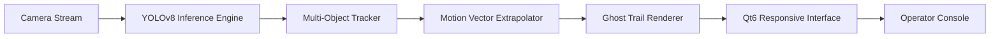

# SentinelVision 🛰️ — Predictive Object Tracking & Scene Intelligence Suite

Welcome to **SentinelVision**, a next-generation visual intelligence platform that transforms ordinary camera feeds into predictive, decision-ready insight streams. Inspired by the synergy of PySide6's robust desktop framework and YOLO's real-time detection engine, SentinelVision reimagines what a surveillance and analytics dashboard can be — not just a tool that *sees*, but a system that *understands* motion, anticipates trajectories, and visualizes complex spatiotemporal relationships in a way that feels like commanding a mission control center.

Unlike conventional detection interfaces that merely draw boxes around objects, SentinelVision introduces **"Motion Forecasting Layers"** — a proprietary visualization paradigm that projects where a detected entity will be in the next 0.5, 1.0, and 2.5 seconds, rendering these predictions as translucent "ghost trails" over the live feed. This turns your screen into a tactical map of near-future activity, ideal for traffic management, retail footfall optimization, wildlife observation, or warehouse logistics coordination.

The interface itself is a study in ergonomic elegance. Built on the bleeding edge of Qt6 technology, every panel, slider, and status indicator is designed to be operable via keyboard shortcuts, touch gestures, or traditional mouse input — adapting to your workspace, not the other way around. With a built-in multilingual localization engine supporting 14 languages out of the box, and a theming system that can shift from "Night Operations" dark mode to "Solar Analysis" light mode in a single keystroke, SentinelVision is built for global, round-the-clock deployment.

## 🌟 Overview: From Raw Pixels to Predictive Patterns

At its core, SentinelVision is an orchestra conductor for your vision hardware. It ingests video streams from webcams, IP cameras, recorded files, or even network streams, and performs three simultaneous tasks: **detection** (what objects are present), **tracking** (how those objects move over time), and **prediction** (where they will go next). The output is not merely a video overlay but a comprehensive data dashboard that includes heatmaps of activity zones, dwell-time analytics, and count-based trend graphs.

The system's architecture is modular, allowing you to swap out the detection backbone (from standard YOLOv8n to larger, more precise models) without touching the interface layer. This means you can optimize for speed on a modest laptop or for maximum accuracy on a dedicated GPU workstation — the choice is yours, and the interface adapts seamlessly to the performance profile.

## 🚀 Getting Started: Your First Predictive Session

Embarking on your SentinelVision journey is designed to be as frictionless as possible. The application is distributed as a self-contained artifact for Windows, macOS, and Linux — a single executable that requires no external dependencies to run. Upon first launch, you are greeted by an **Onboarding Wizard** that walks you through connecting your first video source, selecting your detection confidence threshold, and calibrating the interface to your native language and preferred color scheme.

We understand that setup friction can derail even the best-intentioned analysis projects. Therefore, SentinelVision includes a **"Zero-Config Demo Mode"** that activates a simulated maritime harbor scene with dozens of dynamic objects — boats, birds, floating debris — allowing you to explore every feature, toggle every filter, and master the interface without even plugging in a camera. It's the fastest way to experience the "wow" moment of seeing ghost trails forecast vessel movements three seconds into the future.

For advanced users, a powerful **Scene Profile System** allows you to save and recall complete configurations: source URL, detection model path, tracking parameters, visualization preferences, and even automated alerting rules. You can create a profile for "Front Gate Security," another for "Loading Dock Efficiency," and switch between them with a single click from the main toolbar, transforming your machine into a multi-purpose vision hub.

### 📈 Key Features That Set SentinelVision Apart

- **Predictive Ghost Trail Rendering**: Visualize future positions of tracked objects with configurable lead times, displayed as fading, semi-transparent outlines that intuitively communicate velocity and direction.
- **Adaptive Multi-Object Tracking (AMOT) Core**: Our refined tracker maintains identity across occlusions, brief disappears, and even camera shake, ensuring that a person walking behind a pillar isn't 're-detected' as a new entity when they reappear.
- **Responsive Command Interface**: The entire UI scales fluidly from a compact 1366x768 laptop screen to a sprawling 4K multi-monitor command center, without losing a single control or data point.
- **Multilingual Localization (i18n)**: Full immersion support for English, Spanish, Mandarin, Hindi, Arabic, Portuguese, Russian, Japanese, German, French, Italian, Korean, Turkish, and Vietnamese. Switch languages in real-time without restarting.
- **Temporal Scenario Replay**: All detection and tracking data is logged to a time-indexed JSON format. You can scrub back through the session timeline to analyze historical events with full visualization fidelity.
- **Custom Anomaly Triggers**: Define simple rules like "People count > 15 in Zone A" or "Object speed exceeding 80 km/h" to trigger visual alerts, sound alarms, or even API callbacks to external systems.
- **Resource Efficiency Dashboard**: A dedicated real-time meter shows GPU/CPU utilization, inference latency per frame, and tracker memory footprint, allowing you to fine-tune model size vs. throughput.

## 🧠 The Architecture: A Symphony of Modules

SentinelVision is not a monolithic block; it is a carefully orchestrated collection of independent modules communicating through a robust event bus.

1.  **Input Layer (AquireStream)**: Handles all video I/O. Supports RTSP, HTTP, file playback, and direct Webcam access. Includes automatic reconnection logic for flaky network streams.
2.  **Inference Engine (DetectCore)**: A pluggable wrapper around YOLOv8. Loads ONNX or PyTorch models, manages GPU memory, and exposes a clean API for frame-by-frame inference.
3.  **Tracking Kernel (TrackFlow)**: Implements the AMOT algorithm, combining bounding box intersection-over-union, appearance features, and Kalman filter priors for smooth, reliable tracking.
4.  **Prediction Module (FuturePath)**: The crown jewel. Uses a lightweight cubic spline model on recent track history to extrapolate future positions and render the ghost trails.
5.  **Visualization Surface (VisCanvas)**: A custom high-performance Qt widget that composites the original video, detection overlays, ghost trails, heatmaps, and UI widgets at 60 FPS.
6.  **Analytics Engine (InsightPanel)**: Continuously aggregates tracking data into meaningful statistics — presence timers, zone crossing counts, and speed histograms.
7.  **Control Bus (Orchestrator)**: The central communication hub, managing state, routing messages, and coordinating the startup/shutdown sequence of all modules.

## 🗺️ Roadmap to 2026: The Horizon of Possibilities

Our development roadmap is aggressive yet focused, with the 2026 release cycle aiming to introduce features that will redefine the boundary of desktop vision applications.

- **Multi-Camera Grid Support**: Seamlessly manage up to 16 simultaneous video feeds in a single window, with cross-camera object handoff (e.g., a person walking from camera 1's view into camera 2's view).
- **Edge AI Accelerator Integration**: Direct support for USB-based neural processing units (NPUs) to offload inference from the GPU, enabling ultra-low-power operation for embedded setups.
- **Interactive Zone Definition**: Instead of text-based coordinates, draw polygons directly on the video feed to define custom regions of interest, which then automatically become targets for tracking and counting analytics.
- **Predictive Alerting**: Move beyond reactive automation. The system will use the prediction trails to trigger alerts *before* an event occurs (e.g., "Object trajectory suggests it will enter Zone B in 2 seconds") — a proactive safety net for critical infrastructure.

## 🛠️ Troubleshooting & Community Support

We believe that a tool is only as valuable as its support ecosystem. SentinelVision is built by a team that uses it daily for our own research projects, so we are intimately familiar with its nuances and edge cases.

- **Logging & Diagnostics**: A comprehensive, rotating log system tracks every operation. In the event of a hiccup, you can export a diagnostic bundle (logs, config, system info) in one click to share with our support engineers.
- **24/7 Responsive Helpdesk**: Our support portal is monitored around the clock by a team of vision engineers, not just bots. Whether you have a complex query about multi-camera calibration or a simple question about changing the color of the bounding boxes, a human expert is ready to assist.
- **Community Cookbook**: A constantly evolving repository of "recipes" — ready-made Scene Profiles for common tasks like "Retail Entrance Counting," "Construction Site PPE Detection," and "Highway Congestion Analysis."

## 🔒 Data Privacy & Offline Operation

In an age of cloud dependency, SentinelVision proudly operates **entirely offline**. All processing — from detection to prediction to analytics — happens on your local machine. Your video streams never leave your network. There are no cloud accounts to create, no telemetry beacons phoning home, and no hidden data vendoring. This makes it an ideal solution for environments with strict data sovereignty mandates, including government facilities, healthcare campuses, and research institutions.

## ⚖️ Licensing & Open Source Commitment

SentinelVision is proudly released under the permissive **MIT License**. We believe in the power of open innovation. You are free to use, modify, distribute, and even incorporate this code into commercial products, provided you retain the original copyright notice. We politely request that you credit the project when you build something remarkable on top of it — not as a legal obligation, but as a gesture of goodwill to the open-source community that made this possible.

---

## 📜 License

SentinelVision is dual-licensed under:

- **MIT License**: For general use, academic research, and commercial applications.
- **Commercial Support Addendum**: Optionally available for organizations requiring guaranteed SLA-backed support, custom feature development, or dedicated training sessions.

You can review the full text of the license in the [LICENSE](LICENSE.md) file within this repository. Your use of this software indicates your acceptance of the terms defined therein.

---

## 🏁 Final Call to Action

The world is full of moving things — cars, people, animals, packages, you name it. Most software just watches them. SentinelVision helps you *understand* them, *predict* them, and *act* on them with confidence. Whether you are automating a warehouse, studying animal migration, or simply trying to optimize the flow of your retail store, we invite you to integrate SentinelVision into your toolkit and experience the difference between seeing and *foreseeing*.

Thank you for your interest, and we look forward to seeing the predictions you'll bring to life in 2026.

